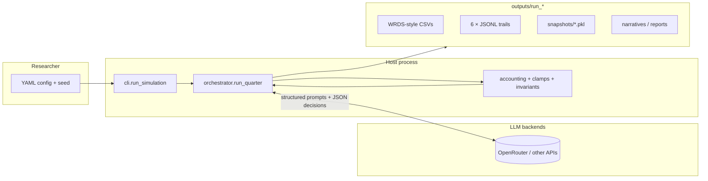
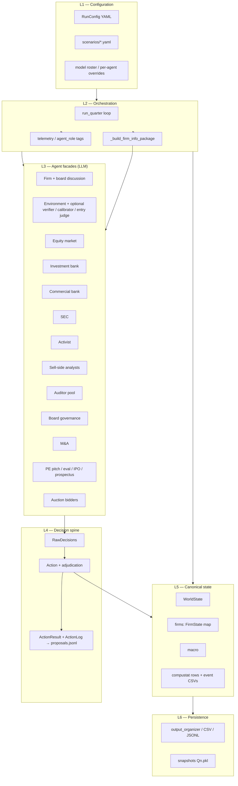
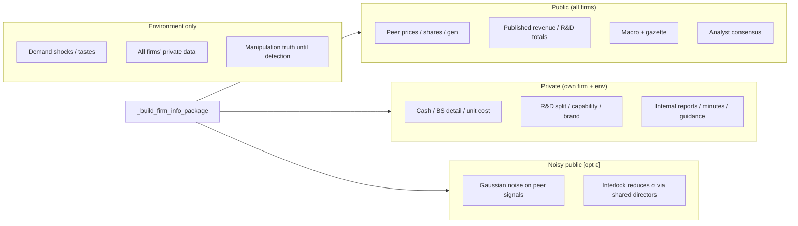
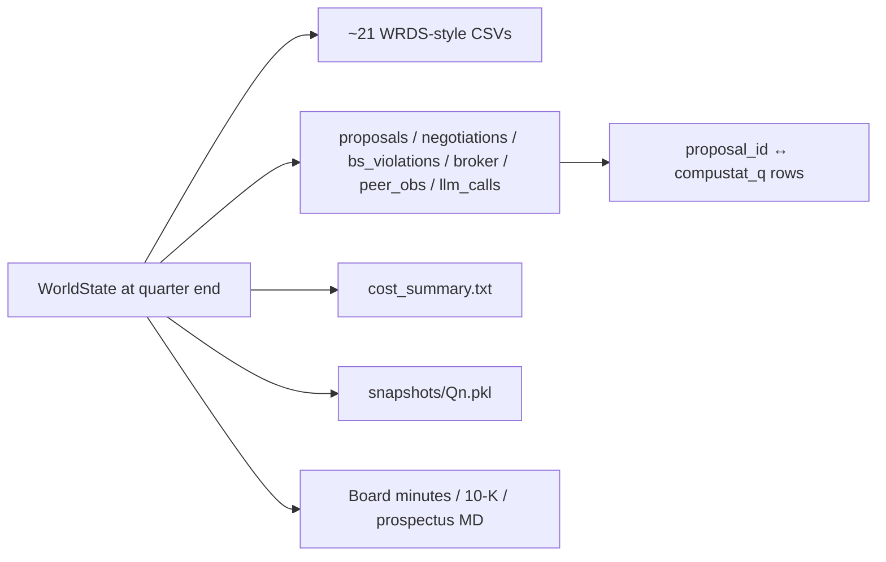
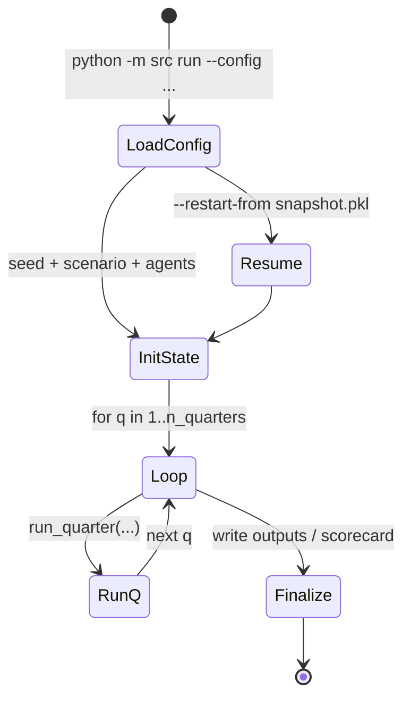

# LLM Firm Lab — architecture & pipeline schema

Detailed diagrams for the **AI lab simulation**: system context, layered design, **canonical quarter pipeline** (as implemented in `src/orchestrator.py::run_quarter`), information boundaries, state I/O, and audit trails.  

**Sources:** `src/orchestrator.py`, `src/cli.py::run_simulation`, `docs/SIMULATION_SUMMARY.md`, `src/config.py` (`RunConfig` toggles). Branches marked **[opt]** depend on YAML toggles and wired agent callables.

---

## 1. System context

Who touches what in a typical **live** run:



**Non-LLM core:** macro stepping, feasibility **clamping**, GAAP **postings**, covenant algebra, settlement, snapshot serialization — all **deterministic code** in the orchestrator/accounting layer.

---

## 2. Layered architecture (logical)



---

## 3. Quarter pipeline (implementation order)

The diagram below follows **`run_quarter`**’s **sequential** phases. Parallelism is noted where the code uses thread pools (e.g. multiple firms).

```mermaid
flowchart TD
  START([Quarter start]) --> P1["P1 — quarter += 1; macro advance"]

  P1 --> P15a{"PE lifecycle?"}
  P15a -->|pe_lifecycle_enabled| PE["λ P1.5 — PE round auction"]
  P15a -->|no| P16b
  PE --> P16["λ P1.6 — IPO event (firm + IB + market)"]
  P16b["skip λ"] --> P17
  P16 --> P17

  P17{"Endogenous entry?"}
  P17 -->|entry_judge| EN["ν+2 P1.7 — entry judge LLM"]
  P17 -->|no| P2
  EN --> P2

  P2["P2 — IPO / legacy path for new public firms"]
  P2 --> P3{"M&A enabled?"}
  P3 -->|yes| MA["P3 — M&A bidding + resolution"]
  P3 -->|no| P4
  MA --> P4

  P4["P4 — SEC surveillance [opt]"]
  P4 --> P45["P4.5 — Activist campaigns [opt]"]

  P45 --> P5PLAN{"Strategic planning κ?"}
  P5PLAN -->|yes| PLAN["P5-pre — per-firm plans (parallel)"]
  P5PLAN -->|no| P5FIRM
  PLAN --> P5FIRM

  P5FIRM["P5 — Firm decisions: info package → RawDecisions (parallel)"]
  P5FIRM --> P5ACT["Activist round-2 + negotiation log [opt]"]

  P5ACT --> CLAMP["Clamp + Action / ActionResult → action_log / proposals"]

  CLAMP --> ENV["P5-env — Environment: demand + R&D + shocks"]
  ENV --> DC{"Demand calibrator?"}
  DC -->|yes| DCAL["LLM calibrates aggregate demand anchor"]
  DC -->|no| EVV
  DCAL --> EVV

  EVV{"Env verifier?"}
  EVV -->|yes| VER["P5.5 — verify / repair env output"]
  EVV -->|no| P57
  VER --> P57

  P57["P5.7 — CEO comp accrual"]
  P57 --> P6["P6 — Accounting postings (GAAP)"]

  P6 --> P65["P6.5 — Debt amortization [covenants]"]
  P65 --> P9["P9 — Earnings announcement / firm [opt]"]
  P9 --> P10["P10 — Sell-side analysts [opt]"]
  P10 --> P11["P11 — Equity market prices public firms"]
  P11 --> P115["P11.5 — Convertible conversion [opt]"]
  P115 --> P116["P11.6 — CEO vest / sell / options"]

  P116 --> P7B["P7b — Investment bank: debt + equity"]
  P7B --> P7C["P7c — Commercial bank: revolver"]
  P7C --> P7D["P7d — Provisional Compustat row"]
  P7D --> P75["P7.5–7.7 — Covenant test + violation resolution [opt]"]

  P75 --> P14["P14 — SEC enforcement → restatements [opt]"]
  P14 --> P14B["P14b — Delisting check"]
  P14B --> P15["P15 — Settlement; solvency; default"]

  P15 --> P15B{"New defaults?"}
  P15B -->|yes| AUC["ν P15b — Distressed asset auction (bidders + judge)"]
  P15B -->|no| ANN
  AUC --> ANN

  ANN{"Fiscal Q4?"}
  ANN -->|yes| A1["A1 — Auditor pool [opt]"]
  ANN -->|no| DIR
  A1 --> A15["A1.5 — Annual reports [opt]"]
  A15 --> A17["A1.7 — ExecuComp equity snapshot"]
  A17 --> A2["A2 — Board governance [opt; 1- or 3-LLM committee]"]
  ANN -->|no| DIR

  A2 --> DIR["Director lifecycle + final Compustat refresh"]
  DIR --> P16RK["P16 — Record-keeping; snapshot Qn.pkl [opt]"]
  P16RK --> ENDQ([Quarter end])
```



**Note:** Comment labels in source use overlapping numbers (e.g. multiple “Phase 5”); the figure above uses **functional names** to avoid confusion.

---

## 4. Firm decision micro-flow (within P5)

```mermaid
sequenceDiagram
  participant O as Orchestrator
  participant IP as Info package builder
  participant F as Firm LLM (+ board thread)
  participant C as Clamp / Action adjudicator
  participant A as Accounting (later phase)

  O->>IP: _build_firm_info_package(state, firm_id)
  IP-->>O: public + private + noisy peer + regime
  O->>F: firm_agent_fn(id, FirmState, package, params)
  F-->>O: RawDecisions (+ structured fields)
  O->>C: clamp + wrap Action
  C-->>O: ClampedDecisions + ActionLog
  Note over O,A: Later: env uses clamped ops; accounting mutates FirmState
```

---

## 5. Information architecture (enforced at source)



---

## 6. Outputs & audit trails (per run)



---

## 7. CLI driver (multi-quarter)



---

## 8. Design rules (engineering invariants)

| Rule | Meaning |
|------|---------|
| **Structured actions** | Material mutations go through **Action** / clamp / **ActionResult**; refusals emit **RejectionEvents**. |
| **LLMs do not post journals** | Accounting math lives in Python; agents emit **decisions**, not ledger rows. |
| **Information boundaries** | Prompts built from **role-specific** subsets of `WorldState`; only env is omniscient. |
| **BS identity** | Assets ≈ Liabilities + Equity within tolerance; drift logged to **`bs_violations.jsonl`**. |
| **Telemetry** | Each API call tagged with **`agent_role`** for **`llm_calls.jsonl`** and **`cost_summary.txt`**. |

---

## 9. How to use this document

- **For coding:** trace any behavior starting at `run_quarter` and search phase comments (`# ── Phase …`).  
- **For papers / methods:** pair §3 with `docs/SIMULATION_SUMMARY.md` quarter list; they are aligned but the **code** wins on ordering when they differ.  
- **For external review:** export this file to PDF or paste Mermaid into [mermaid.live](https://mermaid.live) for static figures.

---

*Schema version: aligned with orchestrator phase blocks as of repository snapshot; regenerate if `run_quarter` signature or phase order changes materially.*
