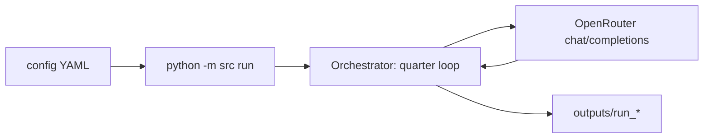

# Day-to-day OpenRouter run — one page

How we **actually** run the lab in development and validation: **OpenRouter** as the default paid backend, YAML-driven roster, and a fixed **output schema** under `outputs/<run_id>/`.

---

## 1. Prerequisites

| Item | Detail |
|------|--------|
| Python | 3.10+; `pip install -r requirements.txt` |
| Credential | **`OPENROUTER_API_KEY`** in `.env` (or shell). Used by `OpenRouterBackend` as `Bearer` token. |
| Optional | `MINIMAX_API_KEY` if any role uses the MiniMax backend; **mock** runs need no key. |

---

## 2. Run commands (typical)

```bash
# No API calls — regression / install check
python -m src run --config config/test_stage12_mock.yaml --mock

# Live OpenRouter (example: short validation)
python -u -m src run --config config/validation_v15_theta.yaml

# Resume after snapshot
python -m src run --config config/my_run.yaml --restart-from outputs/<run_id>/snapshots/Q<N>.pkl
```

Non-mock runs default **`backend: openrouter`** per role unless YAML overrides. HTTP target: **`https://openrouter.ai/api/v1/chat/completions`** with JSON body `model`, `messages`, `temperature`.

---

## 3. Config schema (what you edit)

Each run is a **`config/*.yaml`** plus optional **`scenarios/*.yaml`** when `scenario: <name>` is set.

| Block | Role |
|--------|------|
| `n_firms_initial`, `n_quarters`, `seed` | Simulation scale and RNG seed for non-LLM layers. |
| `default_llm` | Fallback `{ backend: openrouter, model: <slug>, temperature }`. |
| `agents:` | Per-role overrides: `firm_0` … `environment`, `equity_market`, etc. — each `{ model, backend, temperature }`. |
| Boolean toggles | e.g. `sec_enabled`, `ma_enabled`, `pe_lifecycle_enabled`, `cost_telemetry_enabled`, `parallel_firm_decisions`, … |

**Model IDs** are **OpenRouter slugs** (e.g. `mistralai/mistral-small-24b-instruct-2501`, `deepseek/deepseek-v3.2`). `config/model_roster.yaml` is a reference roster; **the active roster is whatever the chosen YAML loads**.

---

## 4. Runtime flow (high level)



Each quarter: build **role-specific prompts** → **`complete` / `complete_json`** on the backend → **clamp + accounting** in code → append state and logs. **`parallel_firm_decisions: true`** overlaps firm LLM calls via a thread pool (still one process).

---

## 5. Output schema (`outputs/<run_id>/`)

| Artifact | Content |
|----------|---------|
| **CSVs** | WRDS-style panels: `compustat_q.csv`, `execucomp.csv`, debt, covenants, analysts, activism, crosswalk, … |
| **`proposals.jsonl`** | Structured actions + adjudication (`proposal_id` links to panel rows where wired). |
| **`negotiations.jsonl`** | Multi-round bargaining (debt, waivers, audit fee, activist, M&A, …). |
| **`llm_calls.jsonl`** | One row per API call: model, backend, `agent_role`, tokens, latency. |
| **`peer_observations.jsonl`**, **`broker_queries.jsonl`**, **`bs_violations.jsonl`** | Observation / broker / balance-sheet drift logs. |
| **`cost_summary.txt`** | Aggregates: total tokens, **estimated USD** from OpenRouter’s **`/api/v1/models`** pricing table at run start (informational; invoice may differ). |
| **`snapshots/Q{N}.pkl`** | Full `WorldState` for `--restart-from`. |
| **`firms/<id>/`** | Narratives: board minutes, product specs, annual reports, etc. |
| **`scorecard.txt`** | Run-level summary / NPV-style scoring when emitted. |

**Run id:** new directory per invocation unless restart logic preserves id (see replication notes in longer memos).

---

## 6. Cost and ops habits

- **`cost_telemetry_enabled: true`** (default in `RunConfig`): fetches OpenRouter model prices once; every call tagged with **`agent_role`** for attribution.  
- **429 / timeout:** client retries with backoff in `OpenRouterBackend`.  
- **Budgeting:** use a short pilot config, read **`Estimated cost:`** in `cost_summary.txt`, scale to batch runs.  

---

## 7. Contrast to manuscript-only specs

Draft paper text may cite **native** OpenAI/Anthropic model names. **Day-to-day repo runs** use **OpenRouter slugs + one key**; align paper, `llm_calls.jsonl`, and appendix roster so an external reader sees one consistent story.

---

*For full quarter-phase detail see [`ai_lab_architecture_and_pipeline_schema.md`](ai_lab_architecture_and_pipeline_schema.md); for draft-paper toggles see [`../paper-draft/one_pager_draft_run_pipeline.md`](../paper-draft/one_pager_draft_run_pipeline.md).*
