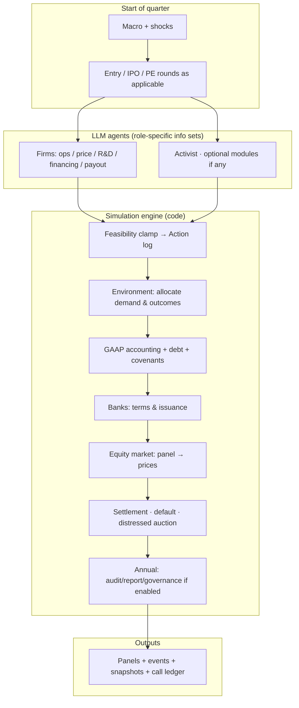

# One-pager: draft-paper run (toggles, roster, pipeline)

## Feature toggles 
 **“production-and-finance subset”**: core product-market and financing stack **without** the listed optional modules. **Distressed asset auctions after default** remain in the bankruptcy block (these are **not** the same as the optional **strategic M&A bidding** module).

| Area | Draft paper | Note |
|------|-------------|------|
| Operating firms + environment | **On** | Product market, R&D/shocks, differentiated demand. |
| Commercial & investment bank | **On** | Revolvers, term debt, covenants; equity/bond placement. |
| Equity market | **On** | **Panel** of LLM analysts; **median** = marked price; no self-valuation. |
| PE sponsor + entry / IPO path | **On** | Dormant entrants; PE activation; IPO when applicable. |
| Board + hidden CEO type | **On** | Annual governance; dismissal discretion. |
| Activist | **On** | e.g. buyback pressure on cash-rich firms. |
| Post-default resolution | **On** | Auction of residual assets; waterfall (draft §Entry/exit). |
| **Auditor** | **Off** | Named optional module. |
| **Sell-side analysts** | **Off** | Named optional module. |
| **SEC surveillance / enforcement** | **Off** | Named optional module. |
| **Strategic M&A bidding** | **Off** | Named optional module; **roll-ups in narrative** tie to **distressed** process. |
| **Restatements** | **Off** | Named optional module. |
| **Earnings-management injection** | **Off** | Named optional module. |

Anything else (e.g. strategic planning, data broker, convertible debt) is **not specified** in the excerpted design text—treat as **replication detail** to freeze in YAML.

---

## LLM roster (exact IDs in the draft)

| Role | Model | Temperature (draft) |
|------|--------|----------------------|
| 6× firm CFO | `gpt-4o-2024-11-20` **and** `claude-3-5-sonnet-20241022` (even split) | Role-specific calibration |
| Environment | `claude-3-5-sonnet-20241022` | **0.30** |
| Equity panel | Rotating **3** of the CFO models → **no firm valued by its own model** | — |
| Commercial bank, IB, board, activist, PE | `gpt-4o-mini-2024-07-18` | **~0.40** (quant.) to **~0.70** (narrative) |

**Backend in draft:** OpenAI / Anthropic **APIs** (not OpenRouter slugs). Full roster YAML + **seed** retained for replication per manuscript.

---

## Initial conditions & macro (snapshot)

- **Industry template:** Longevity therapeutics (high \$ per course; capacity in courses/q; generation ladder in prompts).  
- **\(t=1\) incumbents:** **6** symmetric firms — capability **50**, brand **50**, capacity **250**, PPE **\$300M**, cash **\$200M**, **no debt**.  
- **Macro (start):** policy **3.5%**, equity risk premium **5.0%**, political uncertainty **0.30** (draft).  
- **Horizon:** **80 quarters**; **Q41 snapshot** → code fixes → **resume** remaining segment (draft discloses mixed code path).  
- **Compute (draft):** ~**16** parallel LLM slots, ~**21 h** wall, ~**\$120** API (single run).

---

## Headline results (single run, from draft table / abstract)

| Metric | Value |
|--------|--------|
| Distinct firms (lifetime) | 17 |
| Active at close | 9 |
| Defaults | 8 |
| Distressed consolidations (auction narrative) | 3 |
| Avg HHI | 1,697 |
| Avg top-firm share | 24.2% |
| Panel size | 583 firm-quarters (`compustat_q`) |

---

## High-level pipeline (one quarter)

Read **top → bottom**; **LLM** steps produce structured decisions; **Engine** = deterministic clamps + accounting + settlement.

